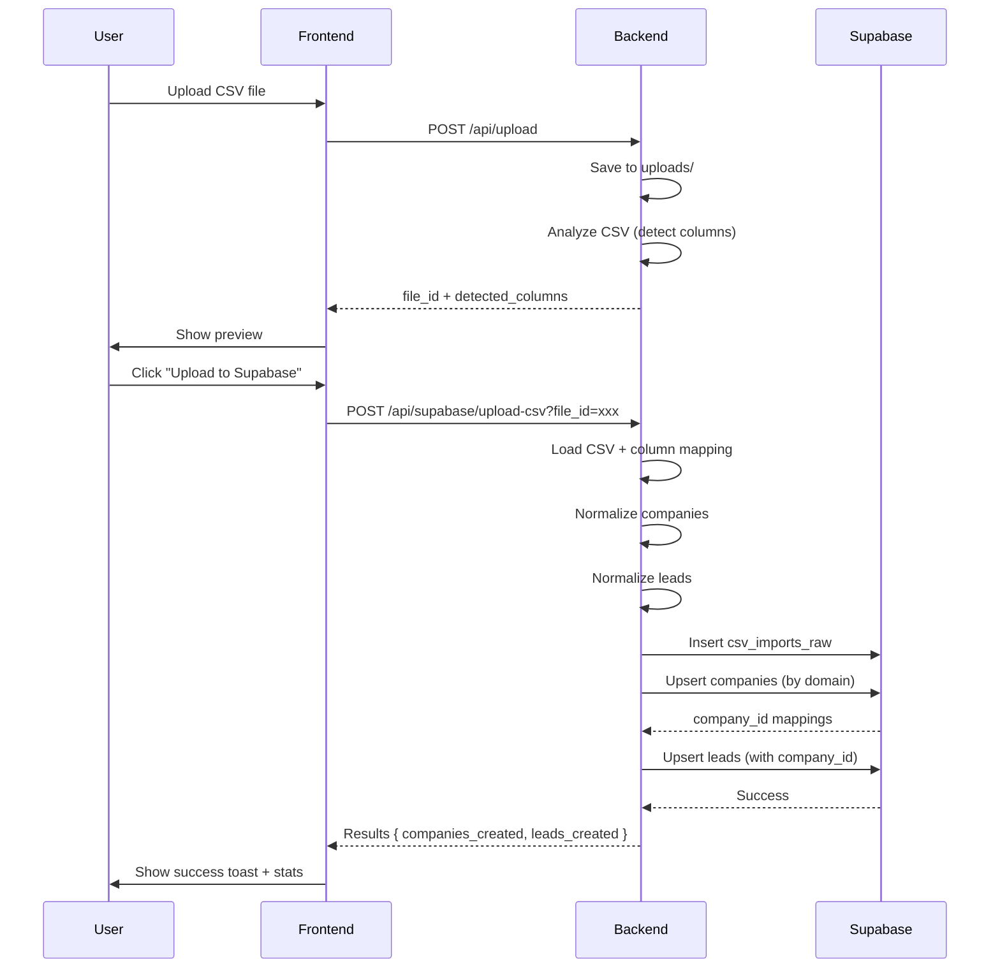

# TASK-005: End-to-End Testing & Documentation

---

## Metadata

```yaml
id: "TASK-005"
title: "Complete E2E Testing & Flow Documentation"
status: "planned"
priority: "P1"
labels: ["testing", "documentation", "integration", "qa"]
dependencies: ["TASK-001", "TASK-002", "TASK-003", "TASK-004"]
created: "2025-10-03"
assignee: "AI Agent"
```

---

## 1. Цель (High-Level Objective)

Протестировать полный flow CSV → Supabase с реальными данными (1777 leads), создать visual flow diagram, написать документацию для пользователей и разработчиков, убедиться что всё работает end-to-end.

---

## 2. Контекст (Background)

**Текущая ситуация:**
- Все компоненты созданы (TASK-001 to TASK-004)
- Каждый компонент протестирован отдельно (unit tests)
- НЕТ полного E2E теста с реальным CSV файлом
- НЕТ documentation flow diagram
- НЕТ user guide

**Проблема:**
- Не знаем работает ли всё вместе
- Не знаем performance на большом CSV (1777 rows)
- Нет документации для пользователей
- Нет troubleshooting guide

**Почему важно:**
- Гарантия что всё работает перед production use
- Документация для будущих разработчиков
- User guide для non-technical пользователей
- Performance baseline для optimization

---

## 3. 🤔 ВОПРОСЫ ДЛЯ ДЕТАЛИЗАЦИИ (ответить перед началом)

### Перед началом выполнения ответь на эти вопросы:

**Q1: Test data**
Какой CSV использовать для тестирования?
- **Вариант A:** `ppc US - Canada...csv` (1777 rows) - full dataset
- **Вариант B:** Создать test CSV с 10 rows
- **Вариант C:** Оба - small для unit tests, large для E2E
- **Рекомендация:** Вариант C

**Q2: Объём тестирования**
Что тестировать?
- Happy path (всё работает)?
- Error cases (bad CSV, network errors)?
- Edge cases (пустые поля, дубликаты)?
- Performance (время загрузки)?
- **Рекомендация:** Всё вышеперечисленное

**Q3: Автоматизация**
Создавать automated tests?
- **Вариант A:** Manual testing only (checklist)
- **Вариант B:** Automated E2E tests (Playwright/Cypress)
- **Вариант C:** Mixed - automated API tests, manual UI tests
- **Рекомендация:** Вариант A для MVP (manual), Вариант B для production

**Q4: Documentation формат**
Какой формат документации?
- **Вариант A:** Markdown files в docs/
- **Вариант B:** Visual diagrams (Mermaid/Excalidraw)
- **Вариант C:** Оба
- **Рекомендация:** Вариант C

**Q5: User vs Developer docs**
Разделять документацию?
- **User Guide:** Как загрузить CSV (screenshots, простой язык)
- **Developer Guide:** Как работает система (technical details)
- **Рекомендация:** Две отдельные документации

**Q6: Performance metrics**
Какие метрики измерять?
- Upload time для 1777 rows
- Memory usage
- API response times
- Database query times
- **Рекомендация:** Все + baseline для future optimization

**Q7: Rollback plan**
Что делать если тесты failed?
- **Вариант A:** Fix bugs and re-test
- **Вариант B:** Document bugs, continue with MVP
- **Вариант C:** Rollback changes, use old system
- **Рекомендация:** Вариант A (fix critical bugs) + Вариант B (document minor issues)

---

## 4. Допущения и Ограничения

**ДОПУЩЕНИЯ:**
- TASK-001 to TASK-004 завершены успешно
- Supabase database работает
- Backend и Frontend запущены локально
- CSV файл доступен

**ОГРАНИЧЕНИЯ:**
- Manual testing только (no automated E2E tests для MVP)
- Single user testing (no concurrent users)
- Local environment only (no staging/production tests yet)

---

## 5. Plan Контекста (Context Plan)

### В начале (добавить в контекст AI):
- `ppc US - Canada...csv` _(test data)_
- Все файлы из TASK-001 to TASK-004
- Supabase Dashboard access

### В конце (должно быть создано):
- `docs/flows/CSV_TO_SUPABASE_FLOW.md` - Visual flow diagram
- `docs/guides/USER_GUIDE_CSV_UPLOAD.md` - User documentation
- `docs/guides/DEVELOPER_GUIDE_CSV_UPLOAD.md` - Technical documentation
- `docs/testing/E2E_TEST_RESULTS.md` - Test results report
- `docs/testing/PERFORMANCE_BASELINE.md` - Performance metrics
- `docs/troubleshooting/CSV_UPLOAD_ISSUES.md` - Common issues & solutions

---

## 6. Пошаговый План (Low-Level Steps)

### Шаг 1: Создать Test CSV (small)

**Файл:** `backend/uploads/test_10_leads.csv` (новый)

**Действие:**
```csv
email,first_name,last_name,title,company_name,website,phone,city,state,country
john@acme.com,John,Doe,CEO,ACME Inc,https://acme.com,+12345678901,New York,NY,United States
jane@techcorp.com,Jane,Smith,CTO,TechCorp,www.techcorp.com,(123) 456-7890,San Francisco,CA,United States
...
```

**Детали:**
- 10 rows
- 5 unique companies (для deduplication test)
- Mix of formats (URLs with/without http, phone formats)
- Some empty fields (phone, linkedin)

---

### Шаг 2: E2E Test Happy Path

**Checklist:**

**Frontend:**
- [ ] 1. Open `http://localhost:3000/script-runner`
- [ ] 2. Click "Upload CSV"
- [ ] 3. Select `test_10_leads.csv`
- [ ] 4. Verify: File uploaded successfully
- [ ] 5. Verify: Preview shows last 15 rows (или 10 если file < 15)
- [ ] 6. Verify: Detected columns показывает правильные типы
- [ ] 7. Click "Upload to Supabase"
- [ ] 8. Verify: Loading spinner показывается
- [ ] 9. Verify: Success toast появляется (3-5 секунд max)
- [ ] 10. Verify: Results Alert показывает stats:
  - Companies created: 5
  - Leads created: 10
  - No errors

**Backend logs:**
- [ ] 11. Check backend console - no errors
- [ ] 12. Verify API response время < 5 секунд

**Supabase Dashboard:**
- [ ] 13. Open https://supabase.com/dashboard/project/tzxoinrwarvnjmplyevv
- [ ] 14. Go to Table Editor → `csv_imports_raw`
- [ ] 15. Verify: 1 row added (raw CSV as JSONB)
- [ ] 16. Go to `companies` table
- [ ] 17. Verify: 5 companies added
- [ ] 18. Check `company_domain` values (no duplicates)
- [ ] 19. Go to `leads` table
- [ ] 20. Verify: 10 leads added
- [ ] 21. Verify: All leads have `company_id` FK
- [ ] 22. Query: `SELECT * FROM leads WHERE company_id IN (SELECT id FROM companies WHERE company_domain = 'acme.com')`
- [ ] 23. Verify: Returns John Doe lead

**✅ Success Criteria:**
All 23 steps passed without errors

---

### Шаг 3: E2E Test Deduplication

**Scenario:** Re-upload same CSV

**Checklist:**
- [ ] 1. Upload `test_10_leads.csv` повторно
- [ ] 2. Verify: Success toast shows:
  - Companies created: 0
  - Companies updated: 5
  - Leads updated: 10
- [ ] 3. Check Supabase `companies` table
- [ ] 4. Verify: Still only 5 companies (no duplicates)
- [ ] 5. Check `leads` table
- [ ] 6. Verify: Still only 10 leads (no duplicates)

**✅ Success Criteria:**
No duplicate companies or leads created

---

### Шаг 4: E2E Test Large Dataset

**Test file:** `ppc US - Canada...csv` (1777 rows)

**Checklist:**
- [ ] 1. Upload large CSV через UI
- [ ] 2. Start timer
- [ ] 3. Wait for upload to complete
- [ ] 4. Record time: _______ seconds
- [ ] 5. Verify: Success toast shows correct counts
- [ ] 6. Check Supabase tables:
  - [ ] Companies: _____ created
  - [ ] Leads: 1777 created
- [ ] 7. Query performance:
  - [ ] `SELECT COUNT(*) FROM leads` - время: _____
  - [ ] `SELECT COUNT(*) FROM companies` - время: _____
- [ ] 8. Check for errors in results

**Performance Baseline:**
- Upload time: Should be < 60 seconds
- Database insert: Should be < 30 seconds
- No memory leaks in browser

---

### Шаг 5: Error Handling Tests

**Test 1: Backend down**
- [ ] 1. Stop backend server
- [ ] 2. Try upload CSV
- [ ] 3. Verify: Error toast shows "Upload failed"
- [ ] 4. Verify: No data in Supabase

**Test 2: Invalid CSV**
- [ ] 1. Create `invalid.csv` with wrong structure
- [ ] 2. Try upload
- [ ] 3. Verify: Error caught and displayed

**Test 3: Network timeout**
- [ ] 1. Simulate slow network (DevTools throttling)
- [ ] 2. Upload CSV
- [ ] 3. Verify: Loading spinner shows
- [ ] 4. Verify: Eventually succeeds or errors gracefully

---

### Шаг 6: Visual Flow Diagram

**Файл:** `docs/flows/CSV_TO_SUPABASE_FLOW.md`

**Содержание:**
```markdown
# CSV to Supabase Upload Flow

## Architecture Diagram



## Data Flow

```
CSV File (1777 rows, 17 columns)
    ↓
Column Detection (TASK-002)
    ↓ detected_columns
Normalization
    ↓
    ├─ Companies (unique by domain)
    │   ↓
    │   Supabase: companies table
    │
    └─ Leads (with company_id FK)
        ↓
        Supabase: leads table
```

## Database Schema

(Include ER diagram or table relationships)
```

---

### Шаг 7: User Guide

**Файл:** `docs/guides/USER_GUIDE_CSV_UPLOAD.md`

**Содержание:**
```markdown
# User Guide: CSV Upload to Supabase

## Prerequisites
- CSV file with lead data
- Required columns: email, company_name (or website)
- Optional columns: first_name, last_name, phone, title, etc.

## Step-by-Step Instructions

### Step 1: Prepare CSV File
- Ensure CSV has header row
- Email column is required
- Company name or website column recommended

### Step 2: Upload CSV
1. Navigate to Lead Processing Center
2. Click "Upload CSV" button
3. Select your CSV file
4. Wait for upload to complete

### Step 3: Review Preview
1. Check last 15 rows in preview table
2. Verify detected columns are correct
3. Look for detected types (Email, Phone, Company, etc.)

### Step 4: Upload to Supabase
1. Click "Upload to Supabase" button
2. Wait for upload (progress spinner shows)
3. Review results in success notification

### Step 5: Verify in Database
1. Open Supabase Dashboard
2. Check companies table
3. Check leads table
4. Verify data is correct

## Common Issues
See [Troubleshooting Guide](../troubleshooting/CSV_UPLOAD_ISSUES.md)
```

---

### Шаг 8: Developer Guide

**Файл:** `docs/guides/DEVELOPER_GUIDE_CSV_UPLOAD.md`

**Содержание:**
```markdown
# Developer Guide: CSV Upload System

## Architecture Overview
See [Flow Diagram](../flows/CSV_TO_SUPABASE_FLOW.md)

## Components

### Backend
- `backend/lib/supabase_client.py` - Singleton Supabase connection
- `backend/lib/column_detector.py` - CSV column type detection
- `backend/services/csv_to_supabase.py` - Business logic
- `backend/main.py` - API endpoints

### Frontend
- `frontend/src/app/script-runner/page.tsx` - UI

### Database
- `migrations/003_csv_imports_raw.sql`
- `migrations/005_companies.sql`
- `migrations/006_leads.sql`

## API Endpoints

### POST /api/upload
Upload CSV file
- **Request:** multipart/form-data
- **Response:** `{ file_id, detected_columns, ... }`

### POST /api/supabase/upload-csv
Upload to Supabase
- **Request:** `{ file_id }`
- **Response:** `{ companies_created, leads_created, ... }`

## Data Normalization

### Companies Deduplication
- Key: `company_domain` (extracted from website URL)
- Strategy: MERGE (update existing, insert new)

### Leads
- Key: `email`
- Strategy: UPDATE existing or INSERT new

## Testing
See [E2E Test Results](../testing/E2E_TEST_RESULTS.md)

## Troubleshooting
See [Troubleshooting Guide](../troubleshooting/CSV_UPLOAD_ISSUES.md)
```

---

### Шаг 9: Performance Baseline Document

**Файл:** `docs/testing/PERFORMANCE_BASELINE.md`

**Содержание:**
```markdown
# Performance Baseline

## Test Environment
- **Date:** 2025-10-03
- **Backend:** Python FastAPI, port 8002
- **Frontend:** Next.js 15, port 3000
- **Database:** Supabase (Free tier)
- **Machine:** (your specs)

## Test Results

### Small CSV (10 rows)
- Upload time: _____ seconds
- Column detection: _____ ms
- Database insert: _____ seconds
- Memory usage: _____ MB

### Large CSV (1777 rows)
- Upload time: _____ seconds
- Column detection: _____ ms
- Companies created: _____
- Leads created: 1777
- Database insert: _____ seconds
- Memory usage: _____ MB

## Bottlenecks Identified
- (list any performance issues)

## Optimization Recommendations
- (suggestions for improvement)
```

---

### Шаг 10: Troubleshooting Guide

**Файл:** `docs/troubleshooting/CSV_UPLOAD_ISSUES.md`

**Содержание:**
```markdown
# Troubleshooting: CSV Upload Issues

## Common Problems

### Upload Failed: "File not found"
**Cause:** File ID expired or backend restarted
**Solution:** Re-upload CSV file

### Upload Failed: "No email column detected"
**Cause:** CSV missing email column
**Solution:** Ensure CSV has email column with valid emails

### Upload Failed: "Supabase connection error"
**Cause:** Missing credentials or network issue
**Solution:**
1. Check `.env` file has SUPABASE_URL and SERVICE_ROLE_KEY
2. Verify Supabase project is running
3. Check network connection

### Duplicate Companies Created
**Cause:** Different website URLs for same company
**Solution:**
- Ensure website column has consistent format
- Check domain extraction logic

### Leads Not Linked to Companies
**Cause:** Missing website/domain in CSV
**Solution:**
- Ensure CSV has website column
- Or manually add companies first

## Performance Issues

### Upload Timeout (> 60s)
**Possible causes:**
- Large CSV file (> 10K rows)
- Slow network
- Supabase rate limiting

**Solutions:**
- Split CSV into smaller batches
- Check network speed
- Upgrade Supabase plan

## Need More Help?
- Check [Developer Guide](../guides/DEVELOPER_GUIDE_CSV_UPLOAD.md)
- Review backend logs
- Contact support
```

---

## 7. Типы и Интерфейсы

```typescript
interface E2ETestResult {
  test_name: string;
  status: 'passed' | 'failed';
  duration_seconds: number;
  errors: string[];
  metrics: {
    upload_time?: number;
    companies_created?: number;
    leads_created?: number;
  };
}

interface PerformanceMetrics {
  upload_time_ms: number;
  detection_time_ms: number;
  database_insert_ms: number;
  memory_usage_mb: number;
  total_rows: number;
}
```

---

## 8. Критерии Приёмки (Acceptance Criteria)

### Testing
- [ ] Happy path E2E test passed (23 steps)
- [ ] Deduplication test passed
- [ ] Large CSV test (1777 rows) passed
- [ ] Error handling tests passed (3 scenarios)
- [ ] Performance baseline recorded

### Documentation
- [ ] Visual flow diagram создан (`CSV_TO_SUPABASE_FLOW.md`)
- [ ] User Guide написан с screenshots
- [ ] Developer Guide содержит technical details
- [ ] Performance baseline document создан
- [ ] Troubleshooting guide содержит 5+ common issues

### Metrics
- [ ] Upload time < 60 секунд для 1777 rows
- [ ] No errors во всех happy path tests
- [ ] Deduplication работает корректно
- [ ] All 1777 leads загружены в Supabase

---

## 9. Стратегия Тестирования (Testing Strategy)

**Manual E2E Testing:**
1. Test small CSV (10 rows)
2. Test large CSV (1777 rows)
3. Test deduplication (re-upload)
4. Test error scenarios

**Documentation Validation:**
1. Follow User Guide step-by-step
2. Verify all steps work
3. Update guide if issues found

**Performance Testing:**
1. Measure upload times
2. Monitor memory usage
3. Record baseline metrics

**Visual Inspection:**
1. Check Supabase Dashboard
2. Verify data integrity
3. Check for duplicates

---

## 10. Заметки / Ссылки (Notes / Links)

**Документация:**
- Mermaid diagrams: https://mermaid.js.org
- Supabase Dashboard: https://supabase.com/dashboard/project/tzxoinrwarvnjmplyevv

**Связанные задачи:**
- TASK-001 to TASK-004 (dependencies)

**Test Data:**
- `ppc US - Canada...csv` (1777 rows)
- Create `test_10_leads.csv` (10 rows)

**Tools:**
- Chrome DevTools для network throttling
- Supabase SQL Editor для queries

---

## ✅ Pre-Execution Checklist

Перед началом выполнения ОБЯЗАТЕЛЬНО ответь на вопросы в секции 3:

- [ ] Выбран test data (Q1: small CSV/large CSV/both)
- [ ] Определён объём тестирования (Q2: happy path/errors/edge cases/performance)
- [ ] Решено про автоматизацию (Q3: manual/automated/mixed)
- [ ] Выбран формат документации (Q4: Markdown/diagrams/both)
- [ ] Решено про User vs Developer docs (Q5: separate/combined)
- [ ] Определены performance metrics (Q6: какие измерять)
- [ ] Есть rollback plan (Q7: fix bugs/document/rollback)

**После ответов на вопросы → начинать выполнение задачи!**

---

**Task Status:** Готова к детализации → Жду ответов на вопросы из секции 3
